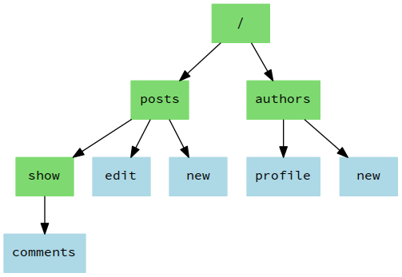
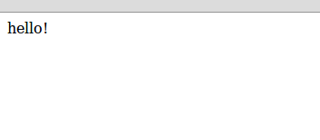

## Введение
---
Я являюсь разработчиком Ruby on Rails с 2011 года. Rails — отличный фреймворк. Но при этом громоздкий и чрезмерно своенравный фреймворк. Он позволяет нам сделать практически все, что угодно, «из коробки» (независимо от того, нужно нам это или нет) без каких-либо дополнительных настроек. Но если мы захотим сделать что-то «нестандартное», то … окажемся предоставлены сами себе.

Именно поэтому спустя некоторое время разработки на Rails я решил, что хочу перейти к более легковесным фреймворкам и использовать более минималистичный подход. Спустя некоторое время, перепробовав несколько джемов, я остановился на Roda — небольшом фреймворке, созданном Джереми Эвансом, который мне очень понравился. На самом деле, Roda так мне понравился, что я захотел поделиться своими знаниями о том, как его использовать.
### Что такое Roda?
Roda представляет собой набор инструментов для построения древа маршрутизации. В основе философии Roda лежат такие принципы, как простота, надежность, расширяемость и производительность, при этом по умолчанию разработчику доступны лишь самые основные функции. Однако благодаря обширной библиотеке плагинов функционал Roda может быть значительно расширен.  

Каждый плагин, поставляемый с Roda, можно рассматривать как отдельный инструмент, который может понадобиться нам в процессе создания веб-приложения. В зависимости от поставленной задачи, мы можем самостоятельно формировать необходимый инструментарий. Таким образом Roda оказывается скорее ближе к расширяемой библиотеке, нежели к фреймворку, хотя ее и принято называть именно так.  

В основе механизма маршрутизации, используемого Roda, лежит построение древа маршрутизации. Как мы увидим в дальнейшем, такой подход обеспечивает Roda невероятную гибкость и мощь. Ключевое преимущество древа маршрутизации заключается в том, что обработка запросов и маршрутизации тесно интегрированы между собой. Возможность обработки запроса непосредственно во время его маршрутизации позволяет устранить дублирование, присущее многим другим веб-фреймворкам, в которых маршрутизация и обработка запросов разделены.  

  

Roda — чрезвычайно легкая библиотека. Основные ее функции, доступные по умолчанию, реализованы менее, чем в 800 строказ кода. Тем не менее, для Roda создано около 100 готовых плагинов, способных удовлетворить потребности большинства веб-разработчиков.  

Roda разрабатывалась с упором на производительность и по праву считается самым быстрым веб-фреймворком Ruby. Хотя некоторые оптимизации усложняют понимание кода, большая часть кодовой базы фреймворка остается наглядной и простой для анализа. Благодаря этому приложения, созданные с помощью Roda, также легко понять, поскольку вы сможете без труда проследить логику его работы и увидеть, как будет маршрутизироваться и обрабатываться тот или иной запрос.  

Roda спроектирована таким образом, чтобы область видимости приложения не засорялась множеством переменных экземпляров, констант и методов. Это помогает избежать неожиданных конфликтов имен. Все внутренние переменные экземпляра, которые использует Roda, имеют префикс в виде знака подчеркивания, а все константы — префикс Roda. При этом в области видимости приложения определены лишь несколько методов.  

В этой книге мы рассмотрим базовые концепции и инструменты, предоставляемые Roda, а также соглашения и передовой опыт, которые помогут начать работу с этой удивительной библиотекой.
### Как читать эту книгу?
Данная книга целиком и полностью основана на примерах. Каждое новое понятие раскрывается через решение конкретной проблемы.  

Вы можете просто прочитать эту книгу от корки до корки. Каждый пример написан так, чтобы вы могли могли воспроизвести его самостоятельно, и я настоятельно советую вам это сделать. Но я также предлагаю вам пойти дальше и начать самостоятельно экспериментировать. Ведь работа с кодом — самый лучший способ закрепить представленные концепции в уме.
### Краткое введение в lucid_http
Прежде, чем приступить к работе с самой Roda, я хотел бы представить вам lucid_http — джем, которыя я создал специально для демонстрации взаимодействий по протоколу HTTP. Данная библиотека используется во всех примерах для отправки запросов и получения ответов от веб-приложения. Здесь я не буду вдаваться в подробности реализации. За дополнительной информацией, пожалуйста, обратитесь к приложению «[Джем lucid_http»](#приложение-джем-lucid_http), приведенному в конце данной книги.  

По своей сути lucid_http представляет собой оболочку для http.rb — библиотеки Ruby, предоставляющей очень простой и согласованный API для выполнения HTTP-запросов. lucid_http предоставляет более высокий уровень абстракции представления, что упрощает работу с http.rb.  

Чтобы продемонстрировать, как работает lucid_http, я создал небольшой скрипт, код которого размещен в файле appendix_lucid_http_app.ru. В [приложении](#приложение-джем-lucid_http) я подробно расскажу, как его запустить.  

Начнем с отправки `GET`-запроса к пути `/hello`. Для этого нам нужно вызвать метод `GET`, передав требуемый путь в качестве аргумента:
```ruby
require "lucid_http"

GET "/hello"                    # => "<h1>Hello World!<h1>"
```  
Метод вернет отрендеренное тело ответа, которое отобразится в виде строки после знака комментария `# =>`.  

По умолчанию базовый URL-адрес, на который мы ориентируемся, — `http://localhost:9292`. Обратите внимание, что конце адреса отсутствует завершающая косая черта, а значит нам необходимо включить ее в путь, по которому мы хотим послать запрос (в нашем случае `/hello`).  

Как мы видим, метод `GET` возвращает тело полученного ответа. Но что на счет другой важной информации? В арсенале lucid_http есть и другие методы:
```ruby
require "lucid_http"

GET "/hello/you"
status                          # => 200 OK
status.to_i                     # => 200
content_type                    # => "text/html"
path                            # => "http://localhost:9292/hello/you"
```
Когда мы делаем следующий запрос, текущая информация удаляется, так что каждый новый запрос начинается с чистого листа:
```ruby
require "lucid_http"

GET "/hello/you"
status                          # => 200 OK
content_type                    # => "text/html"
path                            # => "http://localhost:9292/hello/you"
body[/\>(.+)\</, 1]             # => "Hello, You!"

GET "/403"
status                          # => 403 Forbidden
content_type                    # => "text/html"
path                            # => "http://localhost:9292/403"
body                            # => "The request returned a 403 status."
```
Мы также можем отслеживать перенаправления, передав атрибут `follow: true`:
```ruby
require "lucid_http"

GET "/redirect_me"
status                          # => 302 Found

GET "/redirect_me", follow: true
status                          # => 200 OK
body                            # => "You have arrived here due to a redirection."
```
Если мы получаем код ошибки `500`, то сможем посмотреть, что произошло, вызвав `error`, который вернет первую строку тела ответа, чтобы показать краткое сообщение об ошибке:
```ruby
require "lucid_http"

GET "/500"
status                          # => 500 Internal Server Error
error                           # => "SocketError: SocketError"
```
Если же запрос не возвращает код `500`, библиотека окажется достаточно любезна, чтобы сообщить нам об этом:
```ruby
require "lucid_http"

GET "/not_500"
status                          # => 200 OK
error                           # => "No 500 error found."
```
Если мы обращаемся к `JSON endpoint`, то строковый вывод окажется не лучшим выбором для отображения полученных данных:
```ruby
require "lucid_http"

GET "/hello_world"
# => "You said: hello_world"

GET "/hello_world.json"
# => "{\"content\":\"You said: hello_world\",\"keyword\":\"hello_world\",\"timestamp\":\"2016-12-31 15:00:42 -0300\",\"method\":\"GET\",\"status\":200}"
```
Однако передав атрибут `json: true`, мы получим данные в виде хэша, на который куда приятнее смотреть. Так-то лучше:
```ruby
require "lucid_http"

GET "/hello_world"
# => "You said: hello_world"

GET "/hello_world.json", json: true
# => {"content"=>"You said: hello_world",
#     "keyword"=>"hello_world",
#     "timestamp"=>"2016-12-31 15:01:06 -0300",
#     "method"=>"GET",
#     "status"=>200}
```
lucid_http также поддерживает ряд других глаголов HTTP, которые мы можем использовать:
```ruby
require "lucid_http"

GET     "/verb"                  # => "<GET>"
POST    "/verb"                  # => "<POST>"
PUT     "/verb"                  # => "<PUT>"
PATCH   "/verb"                  # => "<PATCH>"
DELETE  "/verb"                  # => "<DELETE>"
OPTIONS "/verb"                  # => "<OPTIONS>"
```
С помощью lucid_http мы можем отправить на сервер даже форму, воспользовавшись опцией `:form`:
```ruby
require "lucid_http"

POST "/params?item=book", json: true
# => {"item"=>"book"}

POST "/params", json: true, form: { item: "book", quantity: 1, price: 50.0, title: "The complete guide to doing absolutely nothing at all."  }
# => {"item"=>"book",
#     "quantity"=>"1",
#     "price"=>"50.0",
#     "title"=>"The complete guide to doing absolutely nothing at all."}
```
Теперь, когда у вас есть общее представление, как результаты запросов будут отображаться в книге, мы можем приступать к изучению Roda.
## Ядро Roda
В этом разделе мы рассмотрим основные классы Roda, а также поведение и возможности, которые Roda предлагает по умолчанию, иными словами, изучим ядро фреймворка. Однако при обсуждении многих основных функций Roda мы также будем упоминать соответствующие плагины.  

Для начала мы изучим базовую структуру приложения Roda и то, как оно перенаправляет запросы от пользователя к целевому коду, как возвращает соответствующий ответ и как обрабатывает сеансы.
### Очень маленький Hello world
По традиции, начнем с создания Hello world чтобы понять, как вообще выглядит приложение Roda. И в первую очередь нам необходимо создать новый проект.  

Если вы привыкли работать с Rails, то можете подумать, что наверное существует некая команда для генерации нового проекта. Однако напомню, что Roda — скорее библиотека, нежели фреймворк, и такой команды у нее попросту нет, так что все придется делать вручную.  

Первый шаг — создание нового пустого каталога:
```bash
mkdir my_app
```
Теперь добавим в директорию проекта Gemfile для управления джемами. Очевидно, что нам понадобится сам фреймворк, а также веб-сервер, поэтому наш Gemfile будет выглядеть так:
```ruby
source "https://rubygems.org"

gem "roda"
gem "puma"
```
Осталось установить выбранные джемы:
```bash
bundle install
```
Далее в книге мы будем использовать именно эту связку, если не оговорено иное. Однако в любом случае начиная с этого момента указанные джемы будут присутствовать в каждом создаваемом нами Gemfile.  

Теперь мы готовы писать код!  

Практически каждый веб-фреймворк, написанный на Ruby, использует в качестве универсального слоя совместимости Rack, и Roda не является исключением. Поэтому мы начнем разработку с создания rackup-файла, используя стандартное имя `config.ru`.  

В нем мы подключим Roda, а затем создадим новый класс для представления нашего приложения. Этот класс будет наследовать базовому классу Roda.  

Roda построена на идее *древа маршрутизации*, что подразумевает создание *ветвей* путем добавления *маршрутов*. Начнем с определения блока `route`. В качестве аргумента данный блок будет получать запрос, который, по соглашению, мы будем обозначать, как `r`.  

Наш первый маршрут проверяет, относится ли HTTP-запрос к пути `/hello`. Если это так, соответствующий блок кода будет выполнен и вернет строку "hello!".  

Наследуя классу Roda, на класс App неявно становится Rack-приложением. Чтобы указать Rack (и веб-серверу) выполнять наше приложение для HTTP-запросов, мы должны использовать команду `run`:
```ruby
require "roda"

class App < Roda
  route do |r|
    r.get "hello" do
      "hello!"
    end
  end
end

run App
```
Теперь, чтобы запустить веб-сервер и начать обрабатывать запросы, нам достаточно выполнить в терминале команду `rackup`:
```bash
rackup
```
Если теперь перейти по ссылке `http://localhost:9292/hello`, то мы увидим наше первое сообщение. Ура!  

  

Теперь внесем небольшие изменения в наше крошечное приложение. Заменим возвращаемое блоком значение:
```ruby
require "roda"

class App < Roda
  route do |r|
    r.get "hello" do
      "Hello, world!"
    end
  end
end

run App
```
Если мы снова перейдем по ссылке `http://localhost:9292/hello`, то выясним, что ... ничего не изменилось! Почему? Все потому, что на сервере до сих пор работает наш исходный скрипт.  

Вот еще одно напоминание о том, что мы используем не Rails, а нечто куда более простое. Поэтому если нам нужны навороты вроде автоматической перезагрузки при изменении кода, мы должны явно добавить их.  

Наиболее простым решением для автоматической перезагрузки приложения при каждом изменении кода является использование джема [rerun](https://github.com/alexch/rerun/ "rerun"). Добавим его в наш Gemfile:
```ruby
group :development, :test do
  gem "rerun"
end
```
Выполним установку:
```bash
bundle install
```
Теперь для запуска нашего приложения можно использовать команду:
```ruby
rerun rackup
```
Перейдем на `http://localhost:9292/hello` и убедимся, что теперь вывод обновляется без перезапуска приложения:
 
## Приложение: джем lucid_http
---