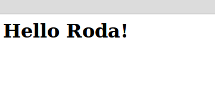
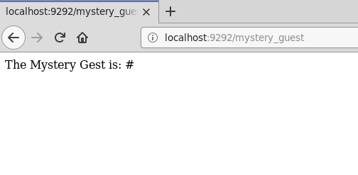
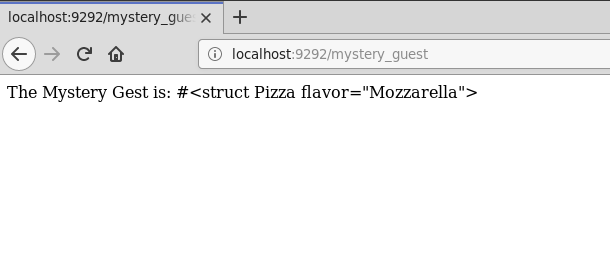

## Введение
---
Я являюсь разработчиком **Ruby on Rails** с 2011 года. **Rails** — отличный, но при этом громоздкий и чрезмерно своенравный фреймворк. Он позволяет нам сделать практически все, что угодно, «из коробки» (независимо от того, нужно нам это или нет) без каких-либо дополнительных настроек. Но если мы захотим сделать что-то «нестандартное», то … окажемся предоставлены сами себе.

Именно поэтому спустя некоторое время разработки на **Rails** я решил, что хочу перейти к более легковесным фреймворкам и использовать более минималистичный подход в разработке. Спустя некоторое время, перепробовав несколько джемов, я остановился на **Roda** — небольшом фреймворке, созданном Джереми Эвансом, который мне очень понравился. Понравился настолько, что я захотел поделиться своими знаниями о том, как его использовать.
### Что такое Roda?
**Roda** представляет собой набор инструментов для построения древа маршрутизации. В основе философии **Roda** лежат такие принципы, как простота, надежность, расширяемость и производительность. И хотя по умолчанию разработчику доступны лишь самые основные функции, благодаря обширной библиотеке плагинов функционал **Roda** может быть значительно расширен.  

Каждый плагин, поставляемый с **Roda**, можно рассматривать как отдельный узкоспециализированный инструмент, который может понадобиться нам в процессе создания веб-приложения, а в зависимости от поставленной задачи, мы можем самостоятельно формировать необходимый инструментарий. Таким образом **Roda** оказывается скорее ближе к расширяемой библиотеке, нежели к фреймворку, хотя ее и принято называть именно так.  

В основе механизма маршрутизации, используемого **Roda**, лежит построение древа маршрутизации. Как мы увидим в дальнейшем, такой подход обеспечивает **Roda** невероятную гибкость и мощь. Ключевое преимущество древа маршрутизации заключается в том, что процессы обработки запросов и маршрутизации тесно интегрированы между собой. Возможность обработки запроса непосредственно во время его маршрутизации позволяет устранить дублирование, присущее многим другим веб-фреймворкам, в которых маршрутизация и обработка запросов разделены.  

  

**Roda** — чрезвычайно легкая библиотека. Основные ее функции, доступные по умолчанию, реализованы менее, чем в 800 строках кода. Тем не менее, для **Roda** создано около 100 готовых плагинов, способных удовлетворить потребности большинства веб-разработчиков.  

**Roda** разрабатывалась с упором на производительность и по праву считается самым быстрым веб-фреймворком **Ruby**. Хотя некоторые оптимизации усложняют понимание кода, большая часть кодовой базы фреймворка остается наглядной и простой для анализа. Благодаря этому любое приложение, созданное с помощью **Roda**, также легко понять, поскольку вы сможете без труда проследить логику его работы и увидеть, как будет маршрутизироваться и обрабатываться тот или иной запрос.  

**Roda** спроектирована таким образом, чтобы область видимости приложения не засорялась множеством переменных экземпляров, констант и методов, что помогает избежать неожиданных конфликтов имен. Все внутренние переменные экземпляра, которые использует **Roda**, имеют префикс в виде знака подчеркивания, а все константы — префикс **Roda**. При этом в области видимости приложения определены лишь несколько методов.  

В этой книге мы рассмотрим базовые концепции и инструменты, предоставляемые **Roda**, а также соглашения и передовой опыт, которые помогут начать работу с этой удивительной библиотекой.
### Как читать эту книгу?
Данная книга целиком и полностью основана на примерах. Каждое новое понятие раскрывается через решение конкретной проблемы.  

Вы можете просто прочитать эту книгу от корки до корки. Каждый пример написан так, чтобы вы могли воспроизвести его самостоятельно, и я настоятельно советую вам это сделать. Но я также предлагаю вам пойти дальше и начать экспериментировать с кодом, ведь это — самый лучший способ закрепить представленные концепции в уме.
### Краткое введение в lucid_http
Прежде, чем приступить к работе с самой Roda, я хотел бы представить вам **lucid_http** — джем, которыя я создал специально для демонстрации взаимодействий по протоколу **HTTP**. Данная библиотека используется во всех примерах для отправки запросов и получения ответов от веб-приложения. Здесь я не буду вдаваться в подробности реализации. За дополнительной информацией, пожалуйста, обратитесь к приложению «[Джем lucid_http»](#приложение-джем-lucid_http), приведенному в конце данной книги.  

По своей сути **lucid_http** представляет собой оболочку для **http.rb** — библиотеки Ruby, предоставляющей очень простой и согласованный **API** для выполнения **HTTP**-запросов. **lucid_http** предоставляет более высокий уровень абстракции представления, что упрощает работу с **http.rb**.  

Чтобы продемонстрировать, как работает **lucid_http**, я создал небольшой скрипт, код которого размещен в файле [appendix_lucid_http_app.ru](assets/scripts/book/appendix_lucid_http_app.ru). В [приложении](#приложение-джем-lucid_http) я подробно расскажу, как его запустить.  

Начнем с отправки **GET**-запроса к пути **/hello**. Для этого нам нужно вызвать метод `GET`, передав требуемый путь в качестве аргумента (удобнее всего работать с **lucid_http** через консольный интерфейс **irb**):
```ruby
require "lucid_http"

GET "/hello"                    # => "<h1>Hello World!<h1>"
```  
Метод вернет отрендеренное тело ответа, которое отобразится в виде строки после знака комментария `# =>`.  

По умолчанию базовый **URL**-адрес, на который **lucid_http** отправляет запросы, — http://localhost:9292. Обратите внимание, что в конце адреса отсутствует завершающая косая черта, а значит нам необходимо включить ее в путь, по которому мы хотим послать запрос (в нашем случае **/hello**).  

Как мы видим, метод **GET** возвращает тело полученного ответа. Но что на счет другой важной информации? В арсенале **lucid_http** есть и другие методы:
```ruby
require "lucid_http"

GET "/hello/you"
status                          # => 200 OK
status.to_i                     # => 200
content_type                    # => "text/html"
path                            # => "http://localhost:9292/hello/you"
```
Когда мы делаем следующий запрос, текущая информация удаляется, так что каждый новый запрос начинается с чистого листа:
```ruby
require "lucid_http"

GET "/hello/you"
status                          # => 200 OK
content_type                    # => "text/html"
path                            # => "http://localhost:9292/hello/you"
body[/\>(.+)\</, 1]             # => "Hello, You!"

GET "/403"
status                          # => 403 Forbidden
content_type                    # => "text/html"
path                            # => "http://localhost:9292/403"
body                            # => "The request returned a 403 status."
```
Мы также можем отслеживать перенаправления, передав атрибут `follow: true`:
```ruby
require "lucid_http"

GET "/redirect_me"
status                          # => 302 Found

GET "/redirect_me", follow: true
status                          # => 200 OK
body                            # => "You have arrived here due to a redirection."
```
Если мы получаем код ошибки **500**, то сможем посмотреть, что произошло, вызвав метод `error`, который вернет первую строку тела ответа, чтобы показать краткое сообщение об ошибке:
```ruby
require "lucid_http"

GET "/500"
status                          # => 500 Internal Server Error
error                           # => "SocketError: SocketError"
```
Если же запрос не возвращает код **500**, при вызове метода `error` библиотека любезно сообщит нам об этом:
```ruby
require "lucid_http"

GET "/not_500"
status                          # => 200 OK
error                           # => "No 500 error found."
```
Если мы обращаемся к **JSON endpoint**, то строковый вывод окажется не лучшим выбором для отображения полученных данных:
```ruby
require "lucid_http"

GET "/hello_world"
# => "You said: hello_world"

GET "/hello_world.json"
# => "{\"content\":\"You said: hello_world\",\"keyword\":\"hello_world\",\"timestamp\":\"2016-12-31 15:00:42 -0300\",\"method\":\"GET\",\"status\":200}"
```
Однако передав атрибут `json: true`, мы получим данные в виде хэша, на который куда приятнее смотреть. Так-то лучше:
```ruby
require "lucid_http"

GET "/hello_world"
# => "You said: hello_world"

GET "/hello_world.json", json: true
# => {"content"=>"You said: hello_world",
#     "keyword"=>"hello_world",
#     "timestamp"=>"2016-12-31 15:01:06 -0300",
#     "method"=>"GET",
#     "status"=>200}
```
**lucid_http** также поддерживает ряд других глаголов **HTTP**, которые мы можем использовать:
```ruby
require "lucid_http"

GET     "/verb"                  # => "<GET>"
POST    "/verb"                  # => "<POST>"
PUT     "/verb"                  # => "<PUT>"
PATCH   "/verb"                  # => "<PATCH>"
DELETE  "/verb"                  # => "<DELETE>"
OPTIONS "/verb"                  # => "<OPTIONS>"
```
С помощью **lucid_http** мы можем отправить на сервер даже форму, воспользовавшись опцией `:form`:
```ruby
require "lucid_http"

POST "/params?item=book", json: true
# => {"item"=>"book"}

POST "/params", json: true, form: { item: "book", quantity: 1, price: 50.0, title: "The complete guide to doing absolutely nothing at all."  }
# => {"item"=>"book",
#     "quantity"=>"1",
#     "price"=>"50.0",
#     "title"=>"The complete guide to doing absolutely nothing at all."}
```
Теперь, когда у вас есть общее представление, как результаты запросов будут отображаться в книге, мы можем приступать к изучению **Roda**.
## Ядро Roda
В этом разделе мы рассмотрим основные классы **Roda**, а также поведение и возможности, которые **Roda** предлагает по умолчанию, иными словами, изучим ядро фреймворка. Однако при обсуждении многих основных функций **Roda** мы также будем упоминать соответствующие плагины.  

Для начала мы изучим базовую структуру приложения **Roda**, разберемся, как оно перенаправляет запросы от пользователя к целевому коду, как возвращает соответствующий ответ и как обрабатывает сеансы.
### Очень маленький Hello world
По традиции, начнем с создания Hello world чтобы понять, как вообще выглядит приложение **Roda**. И в первую очередь нам необходимо создать новый проект.  

Если вы привыкли работать с **Rails**, то можете подумать, что наверное существует некая команда для генерации нового проекта. Однако напомню, что **Roda** — скорее библиотека, нежели фреймворк, и такой команды у нее попросту нет, так что все придется делать вручную.  

Первый шаг — создание нового пустого каталога:
```bash
mkdir my_app
```
Теперь добавим в директорию проекта **Gemfile** для управления джемами. Очевидно, что нам понадобится сам фреймворк, а также веб-сервер (хорошим выбором для нас станет **Puma**). Кроме того, практически каждый веб-фреймворк, написанный на **Ruby**, использует в качестве универсального слоя совместимости **Rack**, и **Roda** не является исключением. В свою очередь, джем **Rackup** предоставляет универсальный интерфейс для запуска приложений **Rack** на поддерживаемых серверах (включая **Puma**), поэтому наш стартовый **Gemfile** будет выглядеть так:
```ruby
source "https://rubygems.org"

gem "roda"
gem "puma"
gem "rack"
gem "rackup"
```
Осталось установить выбранные джемы:
```bash
bundle install
```
Отмечу, что создать приведенный выше **Gemfile** можно непосредственно из консоли, выполнив следующие команды:
```bash
bundle init # Создает пустой Gemfile, содержащий лишь адрес репозитория джемов https://rubygems.org
bundle add roda puma rack rackup # Добавляет необходимые джемы в Gemfile и сразу устанавливает их
```
Далее в книге мы будем использовать именно эту связку, постепенно добавляя новые джемы. Однако в любом случае начиная с этого момента перечисленные выше джемы будут присутствовать в каждом создаваемом нами **Gemfile**.  

Теперь мы готовы писать код! Начнем разработку с создания **rackup-файла**, используя стандартное имя **config.ru**.  

В нем мы подключим **Roda**, а затем создадим новый класс для представления нашего приложения. Этот класс будет наследовать базовому классу `Roda`.  

**Roda** построена на идее *древа маршрутизации*, что подразумевает создание *ветвей* путем добавления *маршрутов*. Начнем с определения блока `route`. В качестве аргумента данный блок будет получать запрос, который, по соглашению, мы будем обозначать, как `r`.  

Наш первый маршрут проверяет, относится ли полученный **HTTP-запрос** к пути `/hello`. Если это так, соответствующий блок кода будет выполнен и вернет строку `"hello!"`.  

Наследуя классу `Roda`, наш класс `App` неявно становится **Rack-приложением**. Чтобы указать **Rack** (и веб-серверу) выполнять наше приложение для **HTTP-запросов**, мы должны использовать команду `run`:
```ruby
require "roda"

class App < Roda
  route do |r|
    r.get "hello" do
      "hello!"
    end
  end
end

run App
```
Теперь, чтобы запустить веб-сервер и начать обрабатывать запросы, достаточно выполнить в терминале команду `rackup`:
```bash
rackup
```
Если после этого перейти по ссылке http://localhost:9292/hello, то мы увидим наше первое сообщение. Ура!  

  

Давайте внесем небольшие изменения в наше крошечное приложение. Заменим возвращаемое блоком значение:
```ruby
require "roda"

class App < Roda
  route do |r|
    r.get "hello" do
      "Hello, world!"
    end
  end
end

run App
```
Если мы снова перейдем по ссылке http://localhost:9292/hello, то увидим, что ... ничего не изменилось! Почему? Все потому, что на сервере до сих пор работает наш исходный скрипт.  

Вот еще одно свидетельство того, что мы используем не **Rails**, а нечто куда более простое. И если нам нужны навороты вроде автоматической перезагрузки при изменении кода, мы должны самостоятельно добавить их.  

Наиболее простым решением для перезагрузки приложения «на лету» при каждом изменении кода является использование джема [Rerun](https://github.com/alexch/rerun/ "Rerun"). Добавим его в наш **Gemfile** в группы `:development` и `:test` (по очевидным причинам в продакшене данный джем будет лишним). Сюда же можно добавить и **lucid_http** (он понадобится нам совсем скоро):
```ruby
group :development, :test do
  gem "rerun"
  gem "lucid_http"
end
```
Выполним установку:
```bash
bundle install
```
Теперь для запуска нашего приложения можно использовать команду:
```ruby
rerun rackup
```
Перейдем на http://localhost:9292/hello и убедимся, что вывод обновляется без перезапуска приложения:  

  

В дальнейшем мы будем постоянно использовать `rerun rackup`, чтобы избежать необходимости постоянного перезапуска сервера вручную.  

Итак, у нас есть работающее веб-приложение, однако мы бы хотели иметь возможность взаимодействовать с ним. Давайте предоставим пользователю возможность указать в приветствии собственное имя. Для этого создадим второй маршрут, указав в качестве нового сопоставителя класс **String**, благодаря чему любое строковое значение (например, **/hello/Federico** или **/hello/Denis**) будет считаться валидным.  

Когда мы указываем в качестве сопоставителя класс **String**, в блок кода передается соответствующий строковый аргумент. Давайте дадим ему подходящее имя, а затем интерполируем в вывод:
```ruby
require "roda"

class App < Roda
  route do |r|
    r.get "hello", String do |name|
      "<h1>Hello #{name}!</h1>"
    end
  end
end

run App
```
Если теперь мы перейдем на http://localhost:9292/hello/Roda, то увидим, что строка `Roda` берется из пути и отображается на странице.  

  

Проведем небольшой рефакторинг. До сих пор мы работали с **rack-файлом** **config.ru**, однако это является не самым лучшим подходом. Как можно догадаться из названия, данный файл предназначен лишь для конфигурации параметров запуска сервера приложений, а не для хранения кода всего приложения.  

Давайте удалим класс **App** вместе с оператором **require** и перенесем код в отдельный файл **app.rb**:
```ruby
require "roda"

class App < Roda
  route do |r|
    r.get "hello", String do |name|
      "<h1>Hello #{name}!<h1>"
    end
  end
end
```
Подключим приложение в **config.ru**:
```ruby
require "./app"

run App
```
Убедимся, что код все еще работает:  

  

Вот оно, наше первое приложение Roda!  

Давайте теперь представим, что мы создаем сайт, который рассказывает посетителям о некоем таинственном госте. Пользователь не знает, кто это такой, однако стоит ему перейти по маршруту **/mystery_guest**, как на экране отобразится имя загадочного гостя.  

По чрезвычайно веским причинам, истоки которых выходят за рамки этой книги, таинственным гостем будет пицца с моцареллой. Для создания класса **Pizza** мы воспользуемся классом **Struct** стандартной библиотеки Ruby, а затем создадим экземпляр этого класса, чтобы использовать его в маршруте **mystery_guest**. Just for lulz, я допустил опечатку в слове Guest:
```ruby
Pizza = Struct.new(:flavor)

class App < Roda
  mystery_guest = Pizza.new("Mozzarella")

  route do |r|
    r.get 'mystery_guest' do
      "The Mystery Gest is: #{mystery_guest}"
    end
  end
end
```
Что-то явно пошло не так:  

  

Но что же произошло? Если мы воспользуемся **lucid_http**, то убедимся, что приложение возвращает верный результат:
```ruby
require "lucid_http"

GET "/mystery_guest"
# => "#<struct Pizza flavor=\"Mozzarella\">"
```
Но почему мы не видим этого в браузере? Давайте рассуждать. Вывод ломается сразу после знака интерполяции **#**. За ним в фигурных скобках следует строка `<struct Pizza flavor="Mozzarella">`, очень похожая на **HTML-тег**. И в этом проблема: такого **HTML-тега** не существует, и браузер не может корректно распознать строку. В противном случае все работало бы идеально, в чем мы можем убедиться, заключив вывод в тег `h1` (строка отобразится, как заголовок первого уровня):
```ruby
require "roda"

Pizza = Struct.new(:flavor)

class App < Roda
  mystery_guest = Pizza.new("Mozzarella")

  route do |r|
    r.get 'mystery_guest' do
      "<h1>The Mystery Gest is: #{mystery_guest}</h1>"
    end
  end
end
```
Как решить данную проблему? Самым очевидным решением было бы воспользоваться методом **to_s** в нашем классе **Pizza**, и все стало бы на свои места. Однако данный подход является сколь наивным, столь и непрактичным. На то есть две важные причины:
- Бывают ситуации, когда нам действительно необходимо отобразить значение переменной или результат отработки того или иного метода, который на самом деле возвращает класс, подобный нашему классу **Pizza**, чего мы не ожидаем. В этом случае мы не сможем точно сказать, где именно необходимо поместить метод **to_s**, так как не уверены, с чем имеем дело.
- Часто нам требуется визуализировать **HTML-код**, который браузер по очевидным причинам всегда интерпретирует, как есть.  

В обоих случаях решение заключается в том, чтобы экранировать вывод. В **Roda** для этого предусмотрен плагин `:h`. После его загрузки мы можем передать строку, которую требуется обработать, в одноименный метод `h`:
```ruby
require "roda"

Pizza = Struct.new(:flavor)

class App < Roda
  plugin :h

  mystery_guest = Pizza.new("Mozzarella")

  route do |r|
    r.get 'mystery_guest' do
      "The Mystery Gest is: #{h mystery_guest}"
    end
  end
end
```
Теперь ответ будет правильно экранирован:
```ruby
require "lucid_http"

GET "/mystery_guest"
# => "The Mystery Gest is: #&lt;struct Pizza flavor=&quot;Mozzarella&quot;&gt;"
```
Конечно необработанный **HTML** выглядит довольно уродливо, зато в браузере результат отображается корректно:  


## Приложение: джем lucid_http
---
